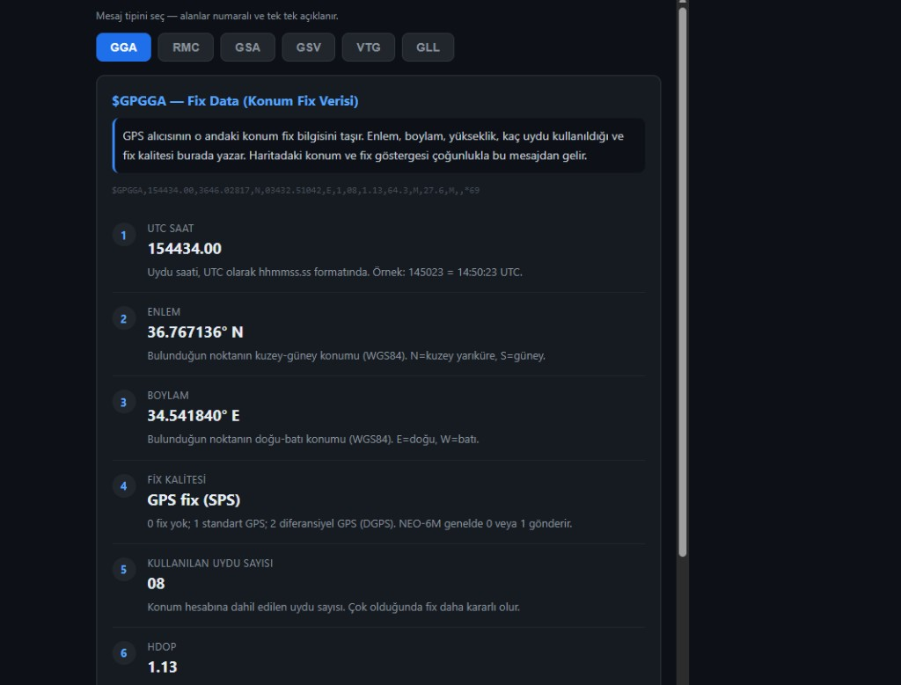
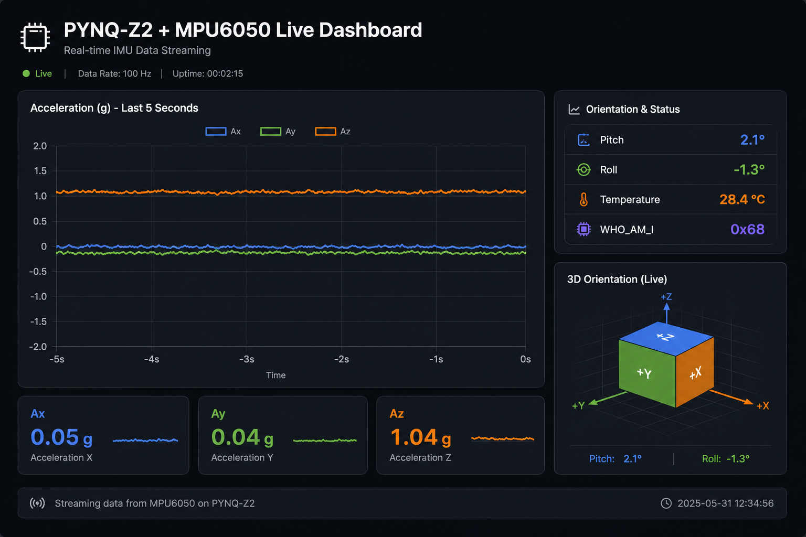
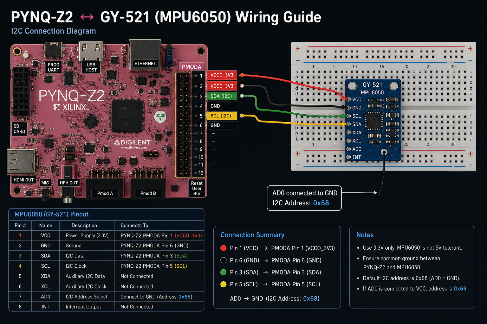
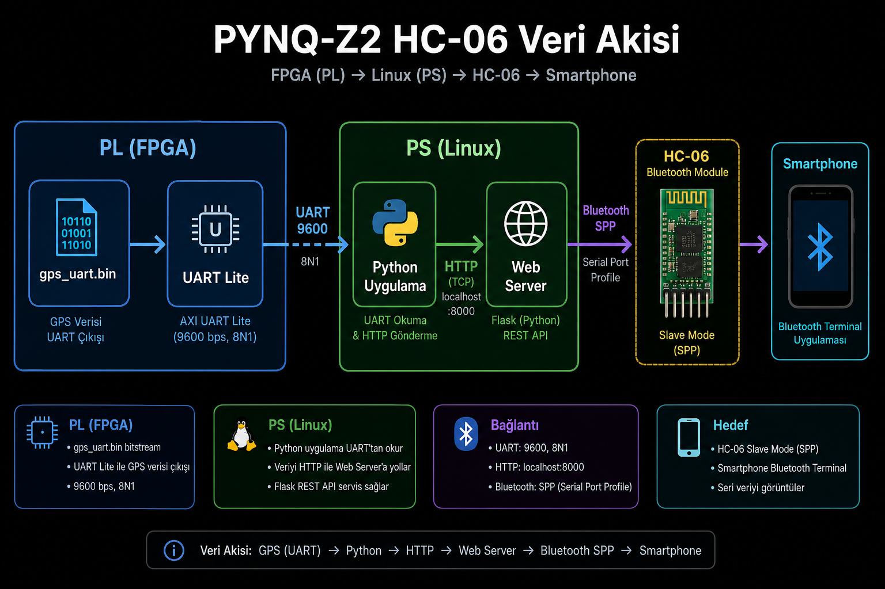

# PYNQ-Z2 + NEO-6M GPS — NMEA Web Dashboard

[](https://github.com/Alp2246/pynq-z2-gps-nmea/releases/tag/v1.0.0)
[](LICENSE)
[](https://www.tul.com.tw)

**Canlı GPS** on **TUL PYNQ-Z2** (Zynq-7020): custom Vivado overlay, **AXI UART Lite** @ `0x42C00000`, Python **MMIO** (`/dev/mem`), browser dashboard with **OpenStreetMap**, satellite SNR chart, and **NMEA 0183 decoder** (GGA · RMC · GSA · GSV · VTG · GLL) with Turkish field explanations.


---

## Live position (verified 2026-06-05)

| | |
|---|---|
| **Fix** | ✅ GPS fix (SPS) |
| **Coordinates** | **36.767085° N, 34.542030° E** |
| **Location** | Mersin, Turkey |
| **Altitude** | 65.2 m |
| **Satellites used** | 8 |
| **UTC time** | 15:47:29 |

📍 [Open in OpenStreetMap](https://www.openstreetmap.org/?mlat=36.767085&mlon=34.542030#map=17/36.767085/34.542030) · [Full API JSON](docs/sample_live_output.json) · [NMEA decode JSON](docs/nmea_messages.json)

---

## Web dashboard

**Pano** — live map, fix badge, lat/lon/alt, UTC clock, SNR bars per satellite.


**NMEA tab** — one message type at a time; raw sentence + numbered fields with Turkish hints.



Supported sentences from the NEO-6M:

| Type | NMEA | Purpose |
|------|------|---------|
| **GGA** | `$GPGGA` | Fix quality, lat/lon, altitude, satellites used, HDOP |
| **RMC** | `$GPRMC` | Minimum navigation: position, speed, course, date |
| **GSA** | `$GPGSA` | Active satellites + PDOP/HDOP/VDOP |
| **GSV** | `$GPGSV` | Satellites in view (PRN, elevation, azimuth, SNR) |
| **VTG** | `$GPVTG` | Track and ground speed (knot + km/h) |
| **GLL** | `$GPGLL` | Geographic lat/lon + fix validity |

### Live NMEA samples (from board)

```
$GPGGA,154729.00,3646.02509,N,03432.52182,E,1,08,1.34,65.2,M,27.6,M,,*6F
$GPRMC,154729.00,A,3646.02509,N,03432.52182,E,0.385,,050626,,,A*76
$GPGSA,A,3,01,04,03,31,09,16,26,07,,,,,2.77,1.34,2.42*0B
$GPGSV,3,3,11,19,03,269,18,26,20,068,24,31,18,042,18*4C
$GPVTG,,T,,M,0.385,N,0.713,K,A*28
$GPGLL,3646.02509,N,03432.52182,E,154729.00,A,A*66
```

---

## Hardware


| NEO-6M | PYNQ-Z2 RPi header | FPGA pin |
|--------|-------------------|----------|
| **VCC** | Pin **1** (3.3 V) | — |
| **GND** | Pin **6** | — |
| **TX** → FPGA RX | Pin **10** | Y6 |
| **RX** ← FPGA TX | Pin **8** | V6 |

9600 baud NMEA 0183 · ceramic patch antenna with clear sky view.

---

## Kod 9928 — PC'den yükle (SD kart dokunma)

Kart açılınca GPS **otomatik** başlar. Yazılım güncellemek için SD kartı çıkarmana gerek yok — PC'den tek komut:

```bat
9928.bat
```

Repo klasöründe çift tık veya CMD:

```bat
cd C:\Users\oalpe\Desktop\neo_gps
9928.bat
```

Ne yapar:
1. Dosyaları SSH ile karta yükler
2. FPGA bitstream yükler
3. **systemd `neo-gps.service`** kurar → her açılışta `http://192.168.2.99:8080` hazır
4. Tarayıcıyı açar

Kartta servis kontrolü:

```bash
systemctl status neo-gps
journalctl -u neo-gps -f    # veya: tail -f ~/neo_gps/gps_web.log
```

---

## Deploy from PC (one click)

PC and board on the same network (default board IP **192.168.2.99**). Requires [PuTTY](https://www.chiark.greenend.org.uk/~sgtatham/putty/latest.html) (`plink` in PATH) and Python on the PC.

**Double-click or run:**

```bat
deploy_gps.bat
```

Or PowerShell:

```powershell
.\deploy_gps.ps1
.\deploy_gps.ps1 -BoardIp 192.168.2.99 -Foreground   # web stays in SSH window
```

This will:

1. Start a temporary HTTP server on the PC
2. Download `gps_web.py`, `neo_gps_pynq.py`, `gps_uart.bin` to the board
3. Load the FPGA bitstream
4. Start the dashboard in the background
5. Open **http://192.168.2.99:8080** in your browser

**Manual (SSH on the board):**

```bash
# PC: in repo folder
python -m http.server 8000

# Board:
bash install_on_board.sh http://<PC-IP>:8000
```

**From git clone on the board:**

```bash
git clone https://github.com/Alp2246/pynq-z2-gps-nmea.git ~/neo_gps
cd ~/neo_gps && bash install_on_board.sh
```

---

## Quick start (manual SSH)

SSH: `xilinx@192.168.2.99` (password `xilinx`)

```bash
cd ~/neo_gps
echo gps_uart.bin | sudo tee /sys/class/fpga_manager/fpga0/firmware
cat /sys/class/fpga_manager/fpga0/state    # operating
bash start_web.sh
```

Browser: **http://192.168.2.99:8080**

> Run **only one** GPS process (`gps_web.py` *or* `neo_gps_pynq.py`). Two clients on the same UART → **bus error**.

Terminal probe:

```bash
sudo python3 neo_gps_pynq.py --probe
```

---

## Architecture


```
NEO-6M  ──UART 9600──►  axi_uartlite_0  ◄──MMIO──  gps_web.py  ◄──HTTP──  Browser
                         0x42C00000              :8080
```

---

## Repository layout

```
├── deploy_gps.bat          # Windows: upload + run (double-click)
├── deploy_gps.ps1          # Same, PowerShell
├── install_on_board.sh     # Board-side install (wget or git clone)
├── gps_web.py              # Web dashboard + NMEA decoder UI
├── neo_gps_pynq.py         # MMIO UART reader / probe
├── start_web.sh            # Start dashboard on the board
├── output/gps_uart.{bin,bit,hwh}
└── docs/
    ├── gps_hardware_setup.png
    ├── neo6m_module.png
    ├── dashboard.png
    ├── nmea_gga_dashboard.png
    ├── wiring_diagram.svg
    ├── architecture.svg
    ├── sample_live_output.json
    ├── sample_live_summary.json
    └── nmea_messages.json
```

---

## Rebuild bitstream (Vivado 2022.2)

```bat
cd vivado
run_build.bat    REM → output/gps_uart.*
```

---

## Requirements

- TUL PYNQ-Z2 + PYNQ image (Linux 5.4+)
- u-blox NEO-6M @ 9600 baud
- PC browser (map tiles from OpenStreetMap)

---

## Roadmap (ideas)

| Feature | Status |
|---------|--------|
| One-click PC deploy (`9928.bat`) | ✅ SD kart guncellemeden |
| Boot auto-start (`neo-gps.service`) | ✅ systemd |
| NMEA decoder UI (6 types) | ✅ live |
| systemd service (boot auto-start) | planned |
| GPX / KML track export | planned |
| SSD1306 OLED lat/lon display | WIP in `sensors/` |
| UBX ephemeris / almanac | blocked (TX path needs loopback test) |
| Home Assistant MQTT bridge | planned |

---

## License

MIT — see [LICENSE](LICENSE).

---

🇹🇷 [Türkçe kurulum rehberi](docs/README_TR.md)

---

## MPU6050 IMU + Live Dashboard (kod 9950)

**FPGA I2C GPIO** + **MPU6050** 6-eksen sensör + **canlı ivme web panosu**.

<table>
<tr>
<td></td>
<td></td>
</tr>
</table>

| | |
|---|---|
| **Dokümantasyon** | [mpu6050/README.md](mpu6050/README.md) |
| **Deploy** | `mpu6050/9950.bat` · `YUKLE.bat` → 2 |
| **Web (kartta)** | http://192.168.2.99:8081 |
| **PC dashboard** | [pynq-mpu6050-dashboard](https://github.com/Alp2246/pynq-mpu6050-dashboard) |

```text
I2C devices: ['0x68']
Ax ≈ +0.05 g  Ay ≈ +0.04 g  Az ≈ +1.04 g  |A| ≈ 1.04 g
```

---

## Related: Sensor Panel (separate project)

Physical displays (OLED + BMP280 + MAX7219 + GPS) — **not** the web dashboard:

→ [sensor_panel/README.md](sensor_panel/README.md) · PC deploy: `sensor_panel/9930.bat`

---

## HC-06 Bluetooth + Web Sohbet (kod 9960)

**FPGA UART** + **Python web sohbet** + **internetten paylaşılabilir link** — PYNQ-Z2 üzerinde HC-06 Bluetooth köprüsü.

<table>
<tr>
<td></td>
<td></td>
</tr>
</table>

| | |
|---|---|
| **Tam dokümantasyon** | [hc06_bt/README.md](hc06_bt/README.md) |
| **PL vs PS rehberi** | [hc06_bt/docs/PL_PS.md](hc06_bt/docs/PL_PS.md) |
| **Deploy** | `hc06_bt/9960.bat` · `YUKLE.bat` → 6 |
| **Yerel** | http://192.168.2.99:8082 |
| **İnternet** | `hc06_bt/internet.bat` |

```text
PL: gps_uart.bin @ 0x42C00000  →  PS: bt_web.py :8082  →  HC-06  →  Bluetooth
[OK] FPGA state: operating
[OK] HC-06 sohbet: http://0.0.0.0:8082
```
