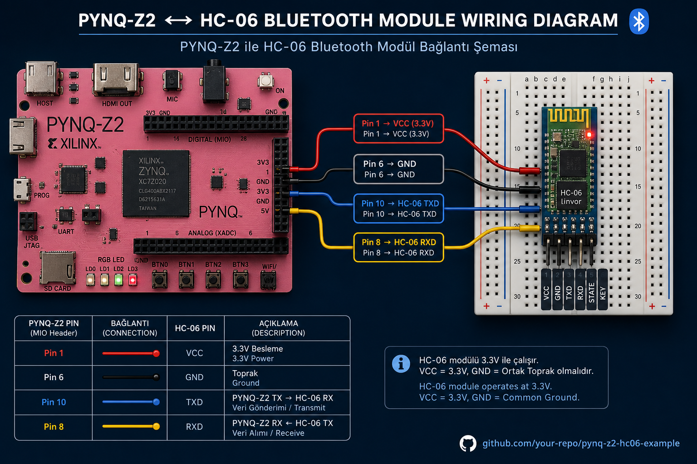
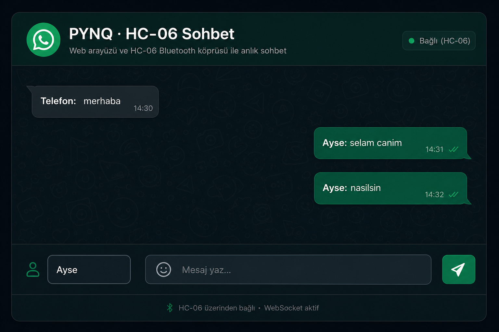

# PYNQ-Z2 + HC-06 Bluetooth — Web Sohbet & SPP Köprüsü

[](9960.bat)
[](https://www.tul.com.tw)
[]()
[]()

**TUL PYNQ-Z2** üzerinde **HC-06 Bluetooth Classic (SPP)** modülü: FPGA **AXI UART Lite** (`gps_uart.bin`, `0x42C00000`), Python **MMIO** köprüsü, **WhatsApp tarzı web sohbet** ve telefon **Serial Bluetooth Terminal** desteği. İnternetten paylaşılabilir link ile uzaktan mesajlaşma (Cloudflare Quick Tunnel).

> 🇹🇷 **PL (FPGA) vs PS (Linux) ne yapıyor?** → [docs/PL_PS.md](docs/PL_PS.md) — detaylı katman rehberi + görseller






---

## PL vs PS — Zynq iki dünyası

PYNQ-Z2 = **PL (FPGA)** + **PS (ARM Linux)**. HC-06 projesi ikisini birlikte kullanır.

| Katman | Ne? | Bu projede |
|--------|-----|------------|
| **PL** | FPGA donanımı | `gps_uart.bin` → UART IP → Pin 8/10 |
| **PS** | Linux + Python | `bt_web.py`, `neo_gps_pynq.py` → MMIO |

### PL tarafı (donanım / FPGA)


- Vivado'da tasarlanan **AXI UART Lite** IP bloğu
- `gps_uart.bin` bitstream kartına yüklenir → `state: operating`
- Fiziksel pinler: **Pin 8 = TX**, **Pin 10 = RX** (RPi header)
- HC-06 ile **9600 baud** seri haberleşme

### PS tarafı (yazılım / Linux)


- PYNQ Linux üzerinde **Python 3** çalışır
- `neo_gps_pynq.py` → `/dev/mem` ile `0x42C00000` adresine yazar (PL köprüsü)
- `bt_web.py` → HTTP sohbet sunucusu (`:8082`)
- PC'de `internet.bat` → Cloudflare tüneli → dünyaya link

📖 **Tam rehber:** [docs/PL_PS.md](docs/PL_PS.md) — veri akışı, hata ayıklama, dosya listesi

---

## Özellikler

| Özellik | Açıklama |
|---------|----------|
| **Echo modu** | Telefondan gelen her satır `ECHO: ...` olarak geri gider |
| **Beacon modu** | Kart periyodik `PYNQ-Z2 HC-06 #N` mesajı gönderir (test) |
| **Web sohbet** | Tarayıcıdan mesaj; HC-06 üzerinden telefona iletilir |
| **İnternet linki** | `internet.bat` → `trycloudflare.com` URL paylaş |
| **Tek tık deploy** | Windows `9960.bat` — SSH ile karta yükle, FPGA + web başlat |

---

## Canlı çıktılar (doğrulanmış)

### FPGA

```text
$ cat /sys/class/fpga_manager/fpga0/state
operating
```

### Hızlı UART testi

```bash
cd ~/hc06_bt
sudo python3 quick_test.py
```

```text
[OK] FPGA state: operating
[TX] PYNQ TEST -> HC-06
[RX] 8 sn dinleniyor (telefondan mesaj gonder)...
  byte 1: 116 't'
  byte 2: 101 'e'
  byte 3: 115 's'
  byte 4: 116 't'
[SONUC] 4 byte alindi
  -> HC-06 CALISIYOR
```

### Web API (`GET /data`)

```json
{
  "messages": [
    {"who": "Ayse", "text": "selam", "src": "web", "ts": 1718995200},
    {"who": "Telefon", "text": "merhaba", "src": "bt", "ts": 1718995205}
  ],
  "tx_count": 3,
  "rx_count": 1
}
```

Tam terminal logları: [docs/terminal_cikti.txt](docs/terminal_cikti.txt) · Örnek JSON: [docs/sample_web_data.json](docs/sample_web_data.json)

---

## Donanım


| HC-06 pini | PYNQ RPi header | Not |
|------------|-----------------|-----|
| **VCC** | Pin **1** (3.3 V) | LED yanmalı |
| **GND** | Pin **6** | |
| **TXD** (modül TX) | Pin **10** | FPGA RX |
| **RXD** (modül RX) | Pin **8** | FPGA TX |

> **GPS ile aynı UART pinleri** — `gps_uart.bin` overlay'i paylaşır. GPS ve HC-06 **aynı anda takılı olmamalı**; aynı anda yalnızca **bir FPGA projesi** yüklü olabilir.

### Sık hatalar

| Belirti | Çözüm |
|---------|--------|
| HC-06 LED sönük | VCC/GND kontrol |
| 0 byte RX | Pin **8↔10** yer değiştir; **DOUT** değil **TXD** kullan |
| Telefon eşleşti ama veri yok | Ayarlarda eşleştirme yetmez — uygulamada **Connect** |
| Web açılmıyor | `bt_bridge` kapat: `sudo pkill -f bt_bridge.py` |

---

## Telefon kurulumu

1. **Ayarlar → Bluetooth** → **HC-06** veya **linvor** → PIN **1234** (veya 0000)
2. Play Store → **Serial Bluetooth Terminal** (Kai Morich)
3. Uygulama → **Connect** → HC-06 seç
4. Mesaj yaz → gönder

---

## PC'den deploy (kod 9960)

Kart IP varsayılan: **192.168.2.99** · SSH: `xilinx` / `xilinx` · [PuTTY](https://www.chiark.greenend.org.uk/~sgtatham/putty/latest.html) gerekli.

```bat
9960.bat
```

veya menüden:

```bat
YUKLE.bat   → 6 = HC-06 Bluetooth
```

Sohbet + web otomatik:

```bat
sohbet_ac.bat
```

### Yerel web

**http://192.168.2.99:8082**

### İnternetten paylaşım (kız arkadaşına link at)

```bat
internet.bat
```

Siyah pencerede `https://xxxx.trycloudflare.com` linki çıkar — **pencere açık kalmalı**.

```
  Sen / kız arkadaşın  ──HTTPS──►  Cloudflare Tunnel  ──►  PC  ──►  PYNQ :8082
                                                                    └──► HC-06 ──BT──► Telefon
```

---

## Kartta manuel

```bash
cd ~/hc06_bt
echo gps_uart.bin | sudo tee /sys/class/fpga_manager/fpga0/firmware
cat /sys/class/fpga_manager/fpga0/state    # operating

sudo python3 bt_bridge.py              # echo
sudo python3 bt_bridge.py --mode beacon --interval 2
sudo python3 bt_web.py --port 8082     # web sohbet
sudo python3 quick_test.py             # 8 sn test
```

---

## Mimari

```
Telefon (BT SPP)  ◄──9600──►  HC-06  ◄──UART──►  axi_uartlite  ◄──MMIO──►  bt_web.py / bt_bridge.py
                              Pin 8/10              0x42C00000              :8082 HTTP
```

| Dosya | Görev |
|-------|-------|
| `bt_web.py` | WhatsApp tarzı web sohbet + `/data` API |
| `bt_bridge.py` | Echo veya beacon terminal köprüsü |
| `quick_test.py` | 8 sn RX test + TX probe |
| `neo_gps_pynq.py` | MMIO UART sürücü (paylaşımlı) |
| `gps_uart.bin` | FPGA bitstream (GPS projesi ile aynı) |
| `deploy.ps1` | SSH deploy |
| `internet.bat` | Cloudflare Quick Tunnel |
| `sohbet_ac.bat` | Deploy + yerel link |

---

## Proje kodları (neo_gps ailesi)

| Kod | Proje |
|-----|-------|
| 9928 | GPS NMEA web |
| 9940 | MAX7219 LED |
| 9950 | MPU6050 |
| 9930 | Sensor panel |
| **9960** | **HC-06 Bluetooth** |

---

## Gereksinimler

- TUL PYNQ-Z2 + PYNQ Linux image
- HC-06 (veya HC-05 slave) @ 9600 baud
- Windows PC + PuTTY (`plink`, `pscp`)
- İnternet tüneli için: `cloudflared` (`internet.bat` otomatik indirir)

---

## Lisans

MIT — üst repo [LICENSE](../LICENSE).

🇹🇷 Ana repo: [neo_gps README](../README.md) · Galeri: [docs/gallery](../docs/gallery/)
