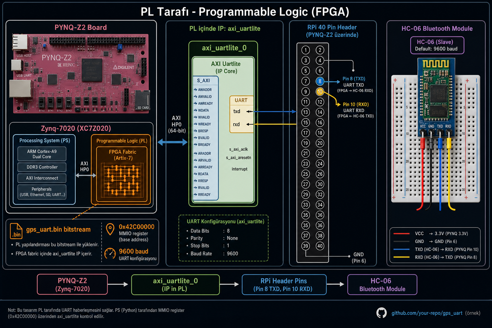
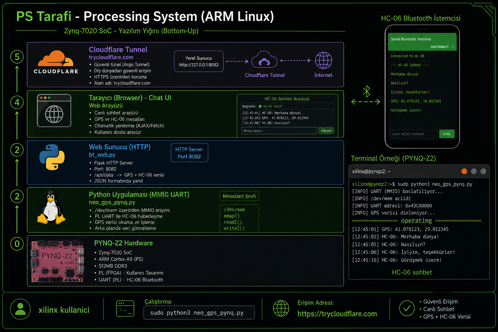

# PL vs PS — HC-06 projesinde kim ne yapıyor?

PYNQ-Z2 kartında **iki dünya** vardır. Bu proje ikisini birlikte kullanır.


---

## Kısa özet

| | **PL (Programmable Logic)** | **PS (Processing System)** |
|---|---------------------------|---------------------------|
| **Ne?** | FPGA çipi — donanım | ARM işlemci — Linux |
| **Dil** | Verilog/VHDL (Vivado) | Python, bash |
| **Bu projede** | UART donanımı, pin sürücü | Web sunucu, BT köprü, deploy |
| **Dosya** | `gps_uart.bin` | `bt_web.py`, `neo_gps_pynq.py` |
| **Adres** | `0x42C00000` (MMIO) | `/home/xilinx/hc06_bt/` |

---

## PL tarafı — FPGA (donanım katmanı)



### PL ne iş yapar?

1. **Bitstream yüklenir** → FPGA konfigüre olur (`operating`)
2. İçinde **AXI UART Lite** IP bloğu çalışır
3. **Pin 8 (TX)** ve **Pin 10 (RX)** fiziksel seviyeye çevrilir
4. **9600 baud** seri veri — HC-06 ile konuşur

### PL'de çalışan dosyalar

```
output/gps_uart.bin     ← Vivado'dan üretilen bitstream (GPS ile paylaşımlı)
vivado/                 ← Kaynak tasarım (repo kökünde)
```

### PL'i yükleme (kartta)

```bash
sudo cp gps_uart.bin /lib/firmware/
echo gps_uart.bin | sudo tee /sys/class/fpga_manager/fpga0/firmware
cat /sys/class/fpga_manager/fpga0/state
# → operating
```

### PL olmadan ne olur?

```text
RuntimeError: FPGA bitstream yuklu degil (state='')
Unhandled fault: external abort on non-linefetch (0x818) at 0xb6f4800c
```

**Özet:** PL = UART'ın **elektriksel** kısmı. Python tek başına pinlere güvenli erişemez; önce FPGA tasarımı yüklenmeli.

### PL kablolama

| FPGA pin (PL) | RPi header | HC-06 |
|---------------|------------|-------|
| UART TX | Pin **8** | RXD |
| UART RX | Pin **10** | TXD |

Şema: [wiring.svg](wiring.svg) · Foto: [wiring.png](wiring.png)

---

## PS tarafı — ARM Linux (yazılım katmanı)



### PS ne iş yapar?

1. **Linux** çalışır (PYNQ image, kullanıcı `xilinx`)
2. **Python** `/dev/mem` ile FPGA register'larına okur/yazar (`MmioUart`)
3. **bt_web.py** HTTP sunucu açar → tarayıcı sohbet
4. **bt_bridge.py** terminal echo / beacon
5. **internet.bat** (PC'de) Cloudflare tüneli → dünyaya link

### PS'de çalışan dosyalar

```
hc06_bt/
├── bt_web.py          # Web sohbet (:8082)
├── bt_bridge.py       # Echo / beacon
├── quick_test.py      # 8 sn UART test
├── neo_gps_pynq.py    # MMIO UART sürücü (PS↔PL köprüsü)
├── deploy.ps1         # PC → SSH → kart
├── internet.bat       # İnternet linki (PC)
└── sohbet_ac.bat      # Tek tık başlat
```

### PS ↔ PL köprüsü (`neo_gps_pynq.py`)

```python
UART_BASE_ADDR = 0x42C00000   # PL'deki UART IP adresi
BAUD_RATE = 9600

class MmioUart:
  # /dev/mem mmap → FPGA register okuma/yazma
  def write_byte(b): ...   # PS → PL → HC-06
  def read_byte(): ...     # HC-06 → PL → PS
```

PS yazılımı **bitstream yüklendikten sonra** `0x42C00000` adresine yazar — bu PL'deki UART FIFO'suna gider.

### PS servisleri (kartta)

```bash
cd ~/hc06_bt
sudo python3 bt_web.py --skip-overlay --port 8082   # Web
sudo python3 bt_bridge.py --skip-overlay             # Echo
```

### PS deploy (PC'den)

```bat
9960.bat          # SSH ile dosya yükle + FPGA + web
sohbet_ac.bat     # Aynı + yerel link göster
internet.bat      # trycloudflare.com linki üret
```

---

## Uçtan uca veri akışı

```
┌─────────────────────────────────────────────────────────────────────────┐
│  PL (FPGA)                    PS (Linux)                                │
│  ┌──────────────┐              ┌─────────────────┐                        │
│  │ axi_uartlite │◄──MMIO──────►│ neo_gps_pynq.py │                        │
│  │ 0x42C00000   │   /dev/mem   │ MmioUart        │                        │
│  └──────┬───────┘              └────────┬────────┘                        │
│         │ Pin 8/10                      │                                 │
└─────────┼───────────────────────────────┼─────────────────────────────────┘
          │ UART 9600                     │ HTTP :8082
          ▼                               ▼
     ┌─────────┐                    ┌───────────┐
     │ HC-06   │◄──── Bluetooth ──►│ Telefon   │
     │ modül   │      SPP 9600     │ + Tarayıcı│
     └─────────┘                    └───────────┘
                                         ▲
                                         │ HTTPS (internet.bat)
                                    Kız arkadaşın telefonu
```

### Mesaj yönleri

| Kim gönderir | Yol |
|--------------|-----|
| Web (Ayşe) | Tarayıcı → `bt_web.py` (PS) → MMIO (PL) → HC-06 → BT → telefon |
| Telefon | BT → HC-06 → UART (PL) → MMIO (PS) → `bt_web.py` → tarayıcı |
| İnternet | `trycloudflare.com` → PC tünel → `192.168.2.99:8082` (PS) |

---

## Tek overlay kuralı

PL'de **aynı anda tek bitstream**:

| Proje | Bitstream | Pin çakışması |
|-------|-----------|---------------|
| GPS / HC-06 | `gps_uart.bin` | Pin 8, 10 |
| MAX7219 LED | `max7219_led.bin` | Pin 11, 13, 15 |
| MPU6050 | `i2c_gpio.bin` | Pin 3, 5 |

HC-06 kullanırken **GPS modülünü sök** veya en azından aynı UART pinlerine bağlama.

---

## Hata ayıklama — PL mi PS mi?

| Belirti | Muhtemel katman |
|---------|-----------------|
| `state=operating` yok | **PL** — bitstream yükle |
| Bus error / fault `0x818` | **PL** — overlay yok veya yanlış |
| `0 byte alindi` | **Kablo / HC-06** — pin 8↔10 |
| Web HTTP 200 ama mesaj yok | **PS** — `bt_bridge` UART'ı tutuyor olabilir |
| Link açılmıyor | **PC** — `internet.bat` penceresi kapalı |
| Telefon eşleşti, veri yok | **Telefon uygulaması** — Connect eksik |

---

## İlgili dosyalar

- [README.md](../README.md) — Ana proje rehberi
- [terminal_cikti.txt](terminal_cikti.txt) — Doğrulanmış loglar
- [sample_web_data.json](sample_web_data.json) — API örneği
