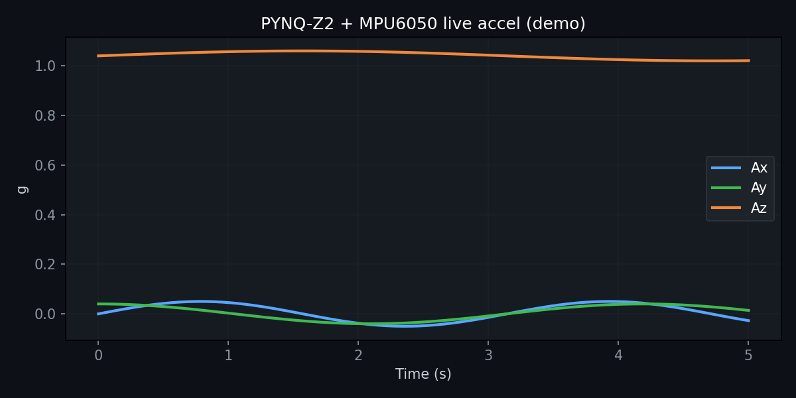
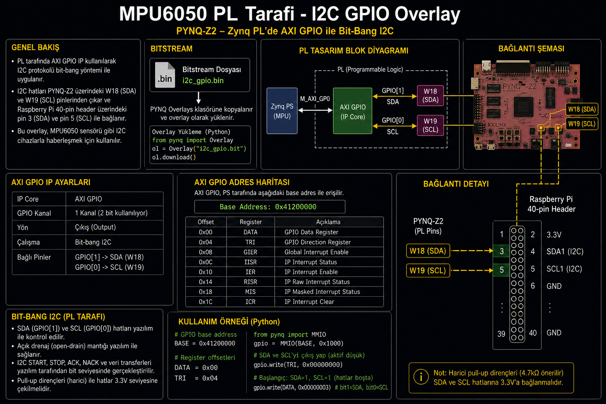
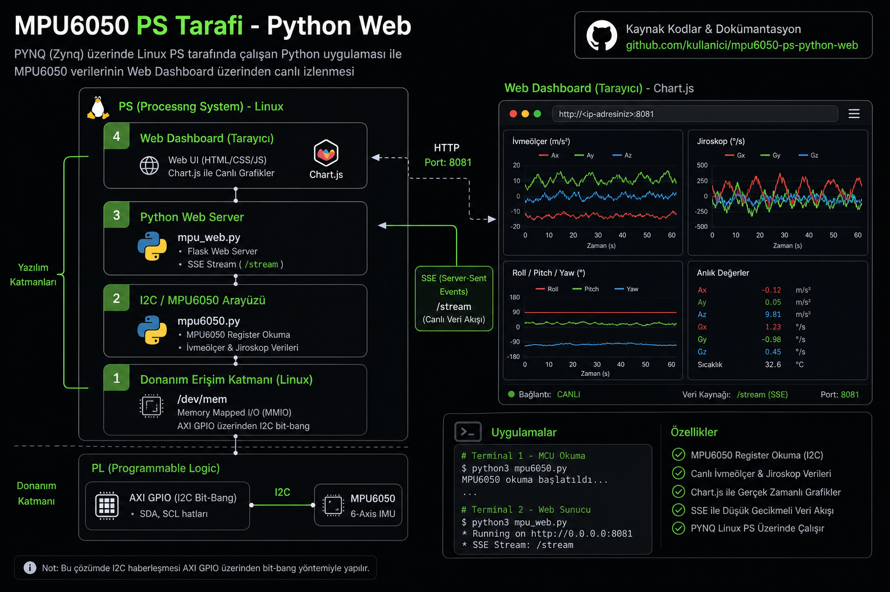

# PYNQ-Z2 + MPU6050 (GY-521) IMU

### FPGA I2C GPIO · Canlı İvme · Web Dashboard

[](9950.bat)
[](https://www.tul.com.tw)
[](#pl-vs-ps)
[](#pl-vs-ps)

**Zynq-7020** + **MPU6050** 6-eksen IMU: PL'de **AXI GPIO bit-bang I2C**, PS'de **canlı ivme/jiroskop web panosu** (~12 Hz).

| | |
|---|---|
| **Web pano** | http://192.168.2.99:8081 |
| **Deploy** | `9950.bat` veya `9950.bat -Web` |
| **Dashboard repo** | [pynq-mpu6050-dashboard](https://github.com/Alp2246/pynq-mpu6050-dashboard) |

---

## Görseller


<table>
<tr>
<td width="50%"></td>
<td width="50%"></td>
</tr>
</table>

---

## PL vs PS

| | **PL (FPGA)** | **PS (Linux)** |
|---|---------------|----------------|
| Bitstream | `i2c_gpio.bin` | — |
| Adres | `0x41200000` (AXI GPIO) | — |
| Pinler | SDA pin 3, SCL pin 5 | — |
| Yazılım | — | `mpu6050.py`, `mpu_web.py` |
| Web | — | `:8081` |





---

## 3 adımda başla

```
1. Kablola          2. Deploy              3. İzle
MPU6050 → 1/3/5/6   9950.bat -Web         http://192.168.2.99:8081
AD0 → GND (0x68)
```

```bat
9950.bat -Web
```

---

## Kablolama

| MPU6050 | PYNQ pin | Not |
|---------|----------|-----|
| VCC | **1** | 3.3 V — **5V kullanma** |
| GND | **6** | |
| SDA | **3** | FPGA W18 |
| SCL | **5** | FPGA W19 |
| AD0 | **GND** | I2C adres `0x68` |

> HC-06/GPS ile **aynı anda tek overlay**. MPU6050 için `i2c_gpio.bin` yüklü olmalı.

---

## Canlı çıktı (doğrulanmış)

```text
I2C devices: ['0x68']
WHO_AM_I=0x70
Ax ≈ +0.05 g   Ay ≈ +0.04 g   Az ≈ +1.04 g   |A| ≈ 1.04 g
```

Kart düz masadayken **Az ≈ 1 g** (yerçekimi) — sensör çalışıyor demektir.

<details>
<summary><b>FPGA state</b></summary>

```bash
echo i2c_gpio.bin | sudo tee /sys/class/fpga_manager/fpga0/firmware
cat /sys/class/fpga_manager/fpga0/state
# operating
```

</details>

---

## Kartta manuel

```bash
cd ~/mpu6050
sudo python3 mpu6050.py --axi-gpio
sudo python3 mpu_web.py --port 8081
```

---

## Dosyalar

```
mpu6050/
├── 9950.bat
├── deploy.ps1
├── docs/
│   ├── mpu6050_dashboard.png
│   ├── mpu6050_wiring.png
│   ├── mpu6050_pl_tarafi.png
│   └── mpu6050_ps_tarafi.png
└── start.sh
```

Kaynak sürücüler: `../sensors/mpu6050.py`, `mpu_web.py`, `axi_gpio_i2c.py`

---

## neo_gps ailesi

| Kod | Proje |
|-----|-------|
| 9928 | GPS |
| 9940 | MAX7219 LED |
| **9950** | **MPU6050** |
| 9930 | Sensor panel |
| 9960 | HC-06 Bluetooth |

Menü: `YUKLE.bat` → **2** veya **3**

---

MIT · [Ana repo](../README.md) · [Galeri](../docs/gallery/)
